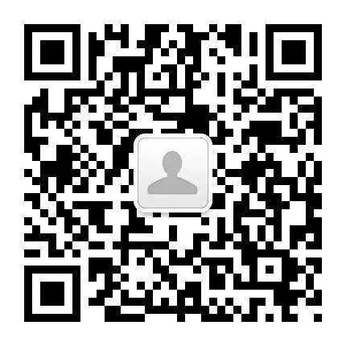
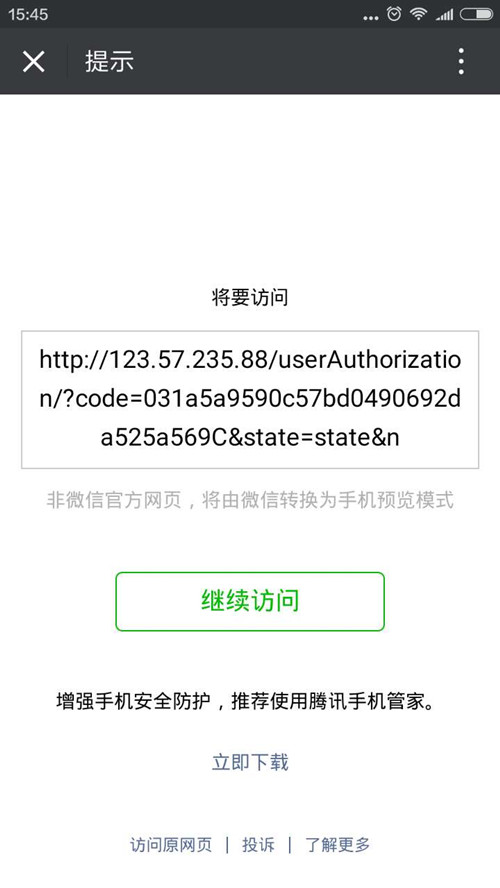

==============
手机搜狐机试题
==============

本项目旨在完成手机搜狐提供的机试题。

题目描述
========

请实现 `微信公众平台 <https://mp.weixin.qq.com/>`_
的 `网页授权获取用户基本信息 <https://mp.weixin.qq.com/wiki/4/9ac2e7b1f1d22e9e57260f6553822520.html>`_
功能，要求：

    1. 授权后展示用户的详细信息
    #. 提供 github 提交历史
    #. 公众号的二维码，测试 URL

功能
====

实现的功能如下：

    1. 获取用户授权，并在回调中异步查询用户信息
    #. 提供接口用于展示用户自己的信息
    #. **（未实现）** 主动刷新 `access_token`

使用
====

1. 微信扫描二维码，关注测试公众号

2. 在微信中点击下面的链接，同意授权后，点击链接获取用户信息

`http://123.57.235.88/userInfo/ <http://123.57.235.88/userInfo/>`_

PS: 微信可能会弹出如下提示，可能需要多点几次才会弹出实际页面。

测试记录
========

功能测试的过程记录在此：

    - [x] 访问 userAuthorization_

        - [x] 携带有效 code，刷新session，更新用户信息，引导至 userInfo_
        - [x] 携带无效 code，刷新session，引导至 userInfo_
        - [x] 未携带 code，错误提示

    - [x] 访问 userInfo_

        - [x] 用户未授权或授权已失效，重定向至授权页面
        - [x] 存在对应用户信息，展示用户信息
        - [x] 不存在对应用户信息，引导至授权页面

    - [ ] wxgz.tasks.request_user_info_by_code_asy 异步正确

.. _userAuthorization: http://123.57.235.88/userAuthorization/
.. _userInfo: http://123.57.235.88/userInfo/
